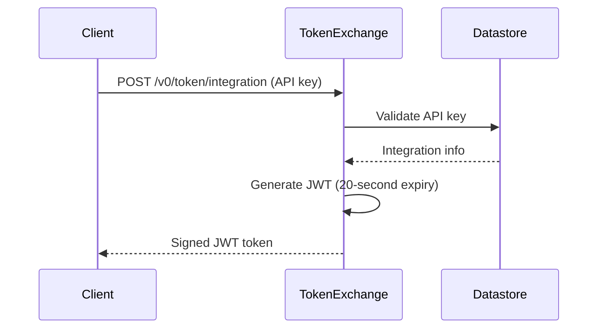

# token-exchange

[](https://goreportcard.com/report/github.com/m-lab/token-exchange)
[](https://github.com/m-lab/token-exchange/actions/workflows/test.yml)
[](https://coveralls.io/github/m-lab/token-exchange?branch=main)
[](https://pkg.go.dev/github.com/m-lab/token-exchange)

A Cloud Run service that exchanges API keys for signed JWTs for M-Lab services.

## API Endpoints

| Method | Path | Description |
|--------|------|-------------|
| `POST` | `/v0/token/autojoin` | Exchange autojoin API key for JWT token |
| `POST` | `/v0/token/integration` | Exchange client integration API key for JWT token |
| `GET` | `/.well-known/jwks.json` | Serve JSON Web Key Set for token verification |
| `GET` | `/health` | Health check endpoint |

## Development

### Build and Test

```bash
# Build all packages
go build -v ./...

# Run all tests with race detection
go test -race -v ./...

# Run tests with coverage
go test -coverprofile=coverage.out -coverpkg=./... ./...
```

### Docker

```bash
# Build Docker image
docker build -t token-exchange .
```

### Deploy to Cloud Run

```bash
gcloud builds submit --config cloudbuild.yaml
```

## Configuration

Configuration is via command-line flags. All flags can also be set via environment variables (e.g., `-port` becomes `PORT`).

| Flag | Default | Description |
|------|---------|-------------|
| `-port` | `8080` | Port to listen on |
| `-private-key-path` | `/secrets/jwk-priv.json` | Path to JWK private key file |
| `-platform-ns` | `platform-credentials` | Datastore namespace for autojoin credentials |
| `-client-integration-ns` | `client-integration` | Datastore namespace for client integration credentials |
| `-project-id` | `mlab-sandbox` | Google Cloud project ID |

## CLI Tools

### create-integration

Creates a new client integration and API key in Datastore.

```bash
go run ./cmd/create-integration -project=mlab-sandbox -integration-id=my-integration
```

Options:
- `-project` (required): Google Cloud project ID
- `-integration-id` (required): Integration ID
- `-namespace`: Datastore namespace (default: `client-integration`)
- `-key-id`: Key ID (auto-generated if not provided)
- `-integration-description`: Human-readable description for the integration
- `-key-description`: Human-readable description for the API key
- `-key-tier`: Service tier for the API key (default: 0)

## Architecture

The service validates API keys stored in Google Cloud Datastore and returns signed JWT tokens. Tokens are signed using RS256 with keys loaded from a JWK file.

### Token Flow


